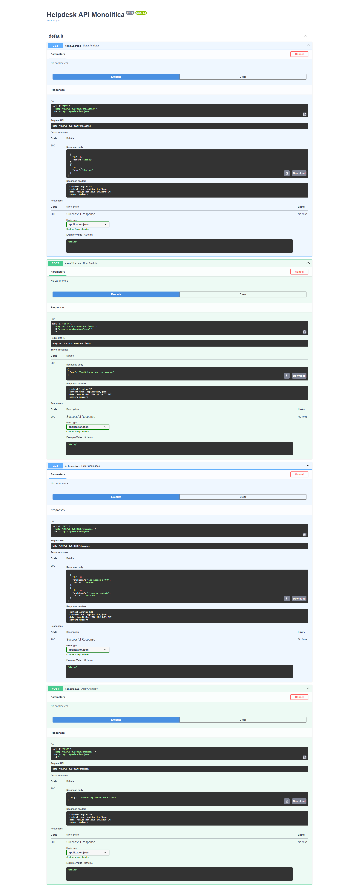

# 🧩 Exercício 05: Organização e Modularização com APIRouter

Este projeto faz parte da série de desafios práticos de Backend. O objetivo aqui é demonstrar como escalar a arquitetura de uma aplicação FastAPI, saindo de um script monolítico para uma estrutura modular e de fácil manutenção.

## 🔴 O Problema: O "Monolito" no `main.py`
Projetos iniciantes tendem a agrupar todas as rotas da aplicação dentro de um único arquivo `main.py`. 
* **Riscos:** Dificuldade extrema de manutenção, alto risco de *Merge Conflicts* em trabalhos em equipe e uma documentação gerada (Swagger) confusa e sem categorização.

**Evidência da Bagunça (Antes):** *(Todas as rotas agrupadas no bloco "default", dificultando a leitura)* 

## 🟢 A Solução: Divisão de Domínios com APIRouter
Aplicamos o conceito de **Separation of Concerns (SoC)** (Separação de Responsabilidades). A aplicação foi dividida em "Domínios" (ex: Analistas e Chamados), cada um com seu próprio arquivo de rotas isolado dentro da pasta `routers/`.

Utilizamos o `APIRouter` do FastAPI para criar sub-aplicações que, no final, são conectadas ao `main.py` de forma limpa.

### Exemplo de Refatoração (A Cura):

O `main.py` deixa de ter a lógica das rotas e passa a ser apenas o "maestro" da aplicação:

```python
from fastapi import FastAPI
from routers import analistas, chamados

app = FastAPI(title="Helpdesk API Modular")

# Conectando as peças (Domínios)
app.include_router(analistas.router)
app.include_router(chamados.router)

```
E nos arquivos de rota (ex: `routers/analistas.py`), utilizamos as `tags` para organizar a documentação:

```python
from fastapi import APIRouter

router = APIRouter(prefix="/analistas", tags=["Equipe de TI"])

@router.get("/")
def listar_analistas():
    return [{"id": 1, "nome": "Sidney"}]

```

**Evidência da Organização (Depois):** O Swagger UI agora categoriza automaticamente os endpoints, melhorando drasticamente a Experiência do Desenvolvedor (DX) que vai consumir a API.

[Swagger Modular](swagger_modular.png)

## 🛠️ Tecnologias Utilizadas

* **Python 3.13**
* **FastAPI** (Uso arquitetural do `APIRouter`)
* **Uvicorn**

## 🚀 Como testar localmente

1. Clone o repositório.
2. Ative seu ambiente virtual e instale as dependências (`pip install -r requirements.txt`).
3. Rode a aplicação: `uvicorn main:app --reload`.
4. Acesse `http://127.0.0.1:8000/docs` para visualizar a interface modularizada.

```
